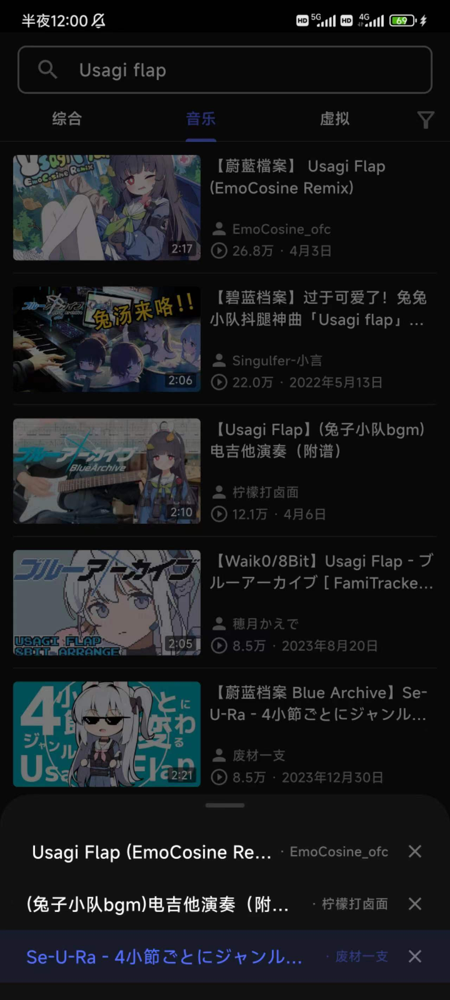

  

# Railgun-

✨ Use Bilibili As Your Audio Player ✨

Railgun- is a mobile application designed to provide playback functionality for Bilibili audio content. This application is built using the Flutter framework, ensuring efficient audio playback and a user-friendly interface.

## Features

- Browse and search Bilibili audio content
- Play and pause audio
- Create and manage playlists
- Background playback support

    
    
    

    
    
    

## Compatibility

| Android | iOS |
| :-----: | :-: |
|    ✔️    |  -  |

## Quick Start

1. Install the Flutter SDK.
2. Clone this repository.
3. Run `flutter pub get` in the project's root directory to install dependencies.
4. Connect an Android device or start an emulator.
5. Run `flutter run` to launch the application.

## Disclaimer

This project is for learning purposes only. Please do not use it for other purposes.
